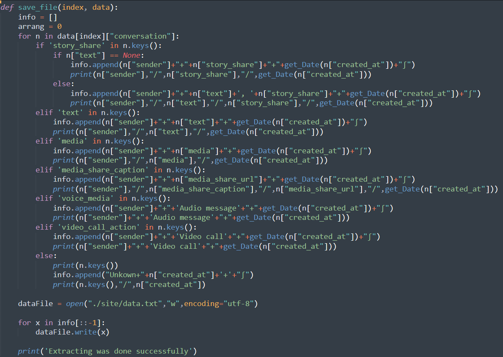
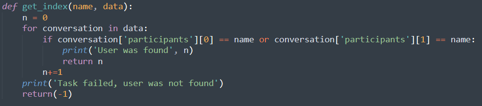
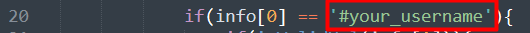

# Instagram chat rectreator
--
## The idea
### Recreate instagram chats
Main use is to recreate instagram chats to comfortly read old messages, 
but can be used for:
* [Find information in json files](#get_index)
* [Resave long json files to short and more comfotable work](#save_file)

## How to use?
1. [Download your instagram data.(click to find out how)](https://help.instagram.com/181231772500920)
2. [Open the first winrar file](https://www.win-rar.com/download.html?&L=0)
3. Place the 'message.json' file in the project folder
4. Open 'Extractor.py' file and write the name of your chat mate.
5. [Open 'index.js' file and change 'your_username' - at line 20.](#Instruction)
6. Open 'index.html' and that's it.

## Uses of functions in python
### save_file
Takes the content of the json file and saves the needed content in a new file.

### get_index
Given the content of the json file and the string which is wanted to be found and in return you get the place in the list wher it's places.

## Instruction

